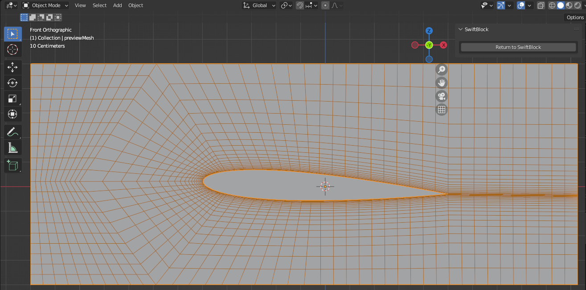

# SwiftBlock

SwiftBlock is a [Blender](https://www.blender.org/) GUI add-on for
the OpenFOAM® *blockMesh* utility, which creates hexahedral block
structured volume meshes for OpenFOAM simulations.
The target of SwiftBlock is to ease the creation of structured
block meshes for controlled grading (e.g. boundary layers) or streched
cells composed of hexahedral cell blocks.

Block structure is first modelled as a mesh object in Blender. A graph
theory based method implemented in the addon identifies the discrete
hexahedral blocks in the mesh object and generates blockMeshDict. Main
features include

* user specified divisions and optional grading of block edges
* specification of patches (boundary surfaces)
* specification of blocks to create cell zones/sets
* easy block manipulations including selection, visualisation and disabling of blocks
* visualization of edge directions
* projection of block edges to surfaces on another object to
  create curved shapes

The add-on is aimed to work with latest
[Blender LTS version](https://www.blender.org/download/lts/) and
latest [OpenFOAM Foundation](https://openfoam.org/) and
latest [OpenFOAM.com](https://openfoam.com) versions.
Tested with Blender 4.2 and OpenFOAM.org v12.

## Documentation

Documentation (made using [Sphinx](https://www.sphinx-doc.org/en/master/))
is located in docs directory of the sources and is viewable online at
https://swiftblock.readthedocs.io.

## Feedback

If you use this add-on, please star the project in GitHub!

### OpenFOAM Trade Mark Notice

This offering is not approved or endorsed by OpenCFD Limited, producer
and distributor of the OpenFOAM software via www.openfoam.com, and
owner of the OPENFOAM® and OpenCFD® trade marks.
